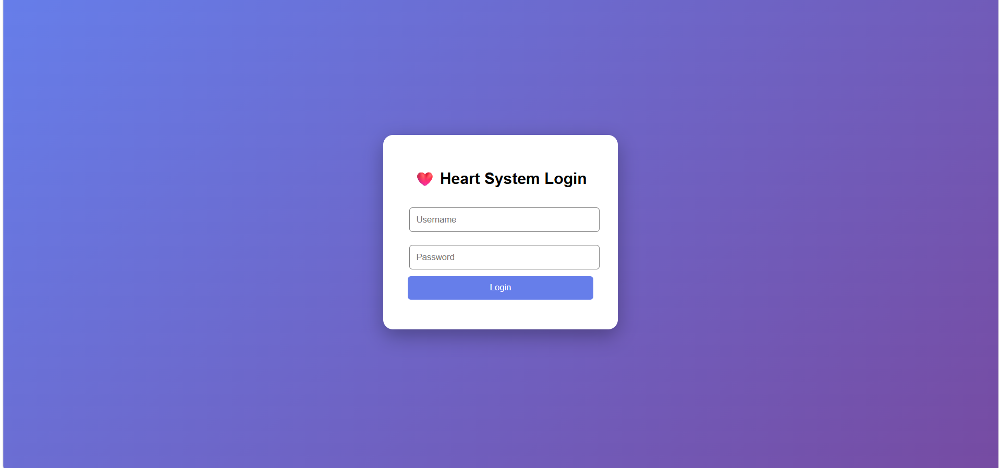
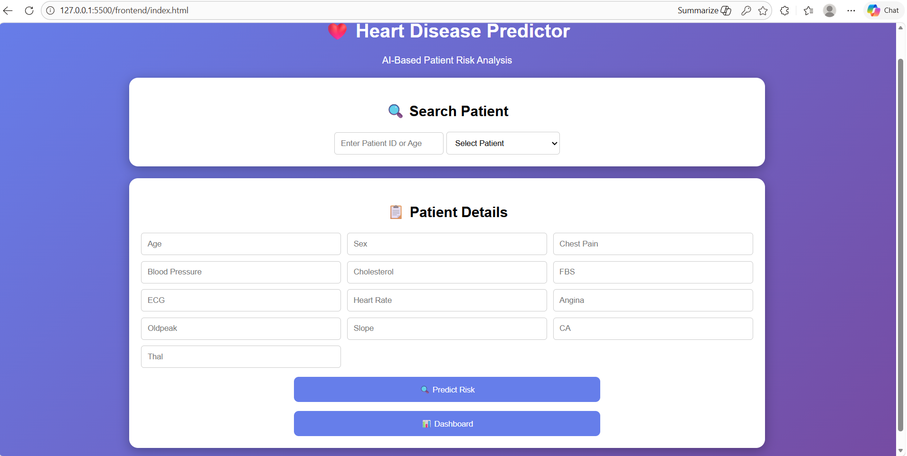
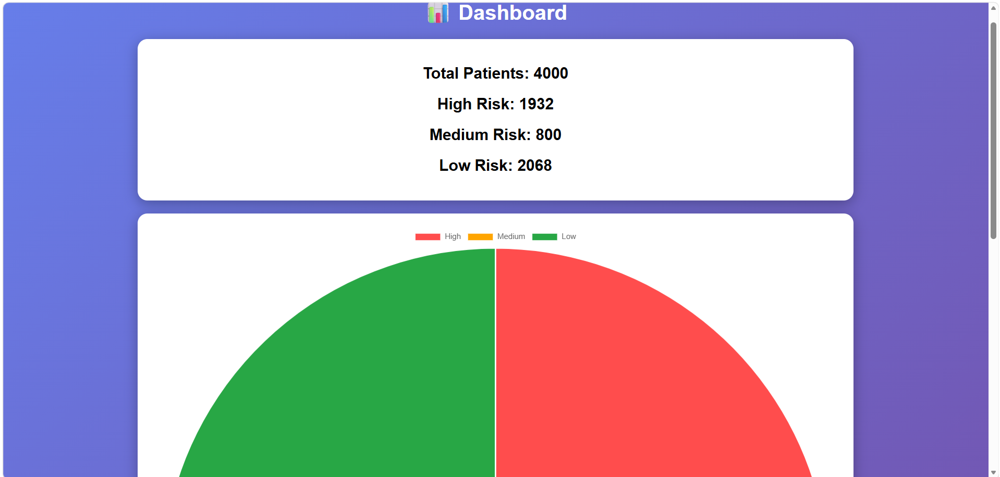

# ❤️ Heart Disease Prediction System using Machine Learning & Deep Learning

---

## 📌 Problem Statement

The objective of this project is to predict the risk of heart disease using Machine Learning and Deep Learning techniques based on patient medical data. Early prediction helps in timely diagnosis and improves healthcare outcomes.

---

## 🔄 Pipeline Diagram

```
User Input
   ↓
Frontend (HTML/CSS/JS)
   ↓
Flask Backend
   ↓
Machine Learning Model (Random Forest)
   ↓
Deep Learning Model (Neural Network)
   ↓
Risk Prediction
   ↓
Database (SQLite)
```

---

## 📊 Dataset Details

* Dataset: UCI Heart Disease Dataset (Kaggle)
* Features: 13 medical attributes (age, cholesterol, blood pressure, etc.)
* Target:

  * 0 → No disease
  * 1 → Disease

---

## 🤖 Models Used

### 🔹 Machine Learning Model

* Algorithm: Random Forest
* Purpose: Provides baseline prediction using structured data

### 🔹 Deep Learning Model

* Algorithm: Neural Network (Keras Sequential Model)
* Architecture:

  * Input Layer (13 features)
  * Hidden Layer 1 (32 neurons, ReLU)
  * Hidden Layer 2 (16 neurons, ReLU)
  * Output Layer (1 neuron, Sigmoid)

---

## 🔗 Integration of ML & DL

Both Machine Learning and Deep Learning models are integrated in the system:

* ML model provides initial prediction probability
* DL model processes scaled data to capture complex patterns
* Final risk classification is based on DL output
* Both ML and DL results are displayed for comparison

---

## 🚀 Why Deep Learning?

Deep Learning helps capture complex nonlinear relationships in medical data, improving prediction accuracy compared to traditional Machine Learning models.

---

## ⚙️ Steps to Run the Project

1. Clone the repository:

   git clone https://github.com/Sreenidhi-1404/heart-disease-predictor.git
   

2. Navigate to backend:

   cd backend


3. Install required dependencies:

   pip install flask pandas scikit-learn tensorflow joblib
   

4. Run the Flask server:

   python app.py
   

5. Open frontend:

   * Open `frontend/login.html` in your browser

---

## 📦 Required Libraries

* Flask
* Pandas
* NumPy
* Scikit-learn
* TensorFlow
* Joblib

---

## 📷 Sample Output

### 🔐 Login Page



### 📊 Prediction Result (ML + DL)



### 📈 Dashboard Visualization



---

## 👨‍💻 Team Members

* Sreenidhi.S — 24BCS280
* Shudharshini.K — 24BCS267
* Kabilan.M — 24BCS116
* Ashwanth Kumar — 24BCS036

---
